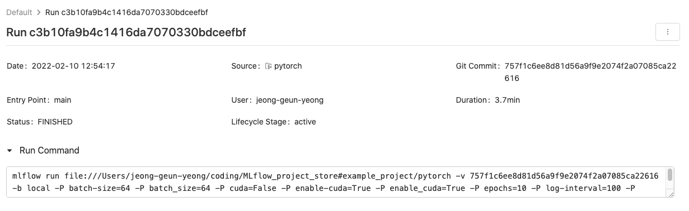
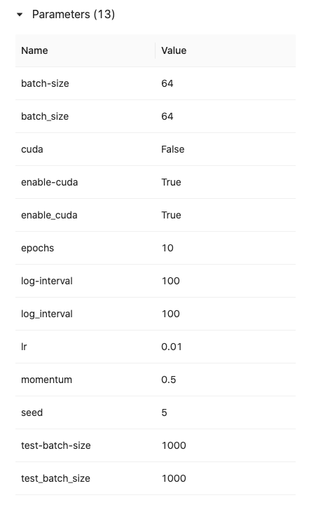
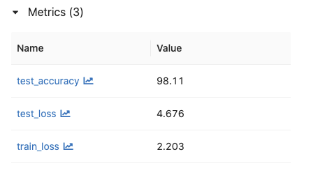
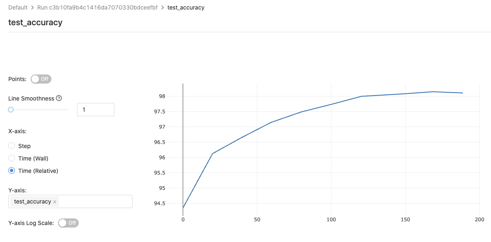
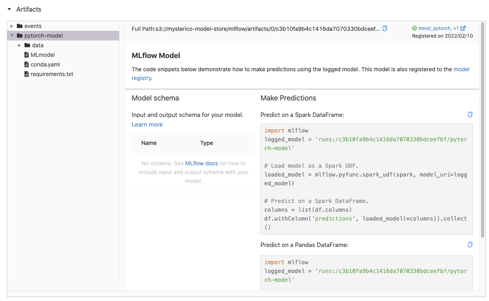

# MLflow_project_store
MLflow에서 사용되는 프로젝트들이 저장되는 저장소입니다.

## 준비 단계
[Ready For MLflow](ready_for_mlflow)

## 데이터 로더
[Example DataLoader](example/data_loader)

## 예제 프로젝트
[Example Project](example/project)

## 예제 model predict
[Example Predict](example/predict)

## 프로젝트 구성
기본적인 프로젝트 구성은 아래와 같습니다.
### conda 이용
```
📦 프로젝트    
 ┣ 📜 conda.yaml     
 ┣ 📜 MLproject   
 ┣ 📜 train.py    
 ┗ 📜 utils.py   
 ```
 `MLProject`의 내용
 ```yaml
name: example

conda_env: conda.yaml

entry_points:
  main:
    parameters:
      epochs: {type: int, default: 5}
      batch_size: {type: int, default: 64}
      learning_rate: {type: float, default: 1e-3}

    command: |
          python mnist_torchscript.py \
            --epochs {epochs} \
            --batch-size {batch_size} \
            --lr {learning_rate}
 ```
 `conda.yaml`의 내용
 ```yaml
 channels:
- conda-forge
dependencies:
- python=3.8.2
- pip
- pip:
  - mlflow
  - cloudpickle==1.6.0
  - boto3
  - torchvision>=0.9.1
  - torch>=1.9.0

 ```
### docker 이용
```
📦 프로젝트    
 ┣ 📜 Dockerfile     
 ┣ 📜 MLproject   
 ┣ 📜 train.py    
 ┗ 📜 utils.py   
 ```
 `MLproject`의 내용
 ```yaml
 name: docker-example

docker_env:
  image:  mlflow-docker-example

entry_points:
  main:
    parameters:
      alpha: float
      l1_ratio: {type: float, default: 0.1}
    command: "python train.py --alpha {alpha} --l1-ratio {l1_ratio}"
 ```
### kubernetes에서 사용
쿠버네티스는 docker를 사용하는 방식에서 kubernetes를 컨트롤하는 파일만 추가됩니다.
```
📦 프로젝트    
 ┣ 📜 Dockerfile     
 ┣ 📜 kubernetes_config.json   
 ┣ 📜 kubernetes_job_template.yaml  
 ┣ 📜 MLproject   
 ┣ 📜 train.py    
 ┗ 📜 utils.py   
 ```
`kubenetes_config.json`의 내용
```json
 {
    "kube-context": "docker-for-desktop",
    "kube-job-template-path": "examples/docker/kubernetes_job_template.yaml",
    "repository-uri": "username/mlflow-kubernetes-example"
}
```
 `kubernetes_job_template.yaml`의 내용
```yaml
apiVersion: batch/v1
kind: Job
metadata:
  name: "example-project"
  namespace: mlflow
spec:
  ttlSecondsAfterFinished: 100
  backoffLimit: 0
  template:
    spec:
      containers:
      - name: "example-project"
        image: "example/project:0.0.1"
        command: ["python train.py --alpha 5.0 --l1-ratio 0.1"]
        resources:
          limits:
            memory: 512Mi
          requests:
            memory: 256Mi
      restartPolicy: Never
```
## Model Registry
Local 환경에서도 호환이 가능하기 위해 Model Registry는 Kubernetes 위에 있는 Minio가 아닌 AWS S3를 사용합니다.   

따라서, conda 및 docker의 dependency를 명시하는 부분에 모델 업로드를 위한 `boto3` 라이브러리를 포함시켜 주어야 합니다.   

`conda.yaml` 및 `Dockerfile` 에 명시합니다.

또한, S3의 권한을 위해 accesskey와 secretkey를 환경 변수로 설정하여야 합니다.

### Conda 또는 Local python 이용시
`.bashrc`, `.zshrc`에 등록 또는 `윈도우 환경변수`에 등록
```shell
export AWS_ACCESS_KEY_ID=나의 액세스 키
export AWS_SECRET_ACCESS_KEY=나의 시크릿 키
export AWS_DEFAULT_REGION=ap-northeast-2
```
### Docker 이용시
`Dockerfile`에 추가
```dockerfile
ENV AWS_ACCESS_KEY_ID 나의액세스키
ENV AWS_SECRET_ACCESS_KEY 나의 시크릿 키
ENV AWS_DEFAULT_REGION ap-northeast-2
```

## Workflow
MLflow를 통한 스크립트 실행시 아래와 같은 workflow를 따릅니다.

---
### 시나리오 1. 개인 venv 또는 Local python을 통한 실행
venv를 통한 실행인 경우 venv에 `mlflow`가 설치 되어 있어야 합니다.    
venv에 필요한 dependency 패키지를 준비해둔 상태에서 시작.   
```shell
(venv)keyog@~$ mlflow run --no-conda /my/project/path
```
파라미터 적용시 
```shell
(venv)keyog@~$ mlflow run --no-conda -P epoch=10 /my/project/path
```
> **주의사항**     
> 가상환경으로 실행시 `mlflow`를 해당 환경에 설치한게 아니라면,    
> `mlflow` 명령이 제대로 동작하지 않을 수 있다.    
---
### 시나리오 2. conda 이용
`conda.yaml` 파일을 작성하여 프로젝트 폴더에 넣어두고 실행.
```shell
(base)keyog@~$ mlflow run /my/project/path
```
파라미터 적용시 
```shell
(base)keyog@~$ mlflow run -P batch_size=32 /my/project/path 
```
> **주의사항**     
> conda환경으로 실행시 `mlflow`를 (base)환경에 설치한게 아니라면,   
> `mlflow` 명령이 제대로 동작하지 않을 수 있다.    
> Local환경에 설치하려는 경우 `conda deactivate`로 가상환경에서 빠져나와서 명령 수행하여야 한다.
---
### 시나리오 3. docker 이용
`Dockerfile`을 통해 Local에 이미지를 만들거나 이미 만들어진 환경의 이미지를 사용합니다.   
`MLproject` 파일에 이미지 명세만 잘해주면 잘 동작합니다.
```shell
keyog@~$ mlflow run /my/project/path
```
파라미터 적용시 
```shell
keyog@~$ mlflow run -P learning_rate=0.001 /my/project/path 
```
---
### 시나리오 4. kubernetes 이용
kubernetes 클러스터에서 코드를 실행하기 위해 사용합니다.    
`kubernetes_config.json` 파일과 `kubernetes_job_template.yaml` 파일을 생성한뒤 실행합니다.
```shell
keyog@~$ mlflow run --backend kubernetes \
--backend-config /my/project/path/kubernetes_config.json \
/my/project/path
```
> **주의사항**     
> 필요한 경우 kubernetes에서 training작업을 진행할순 있지만,   
> kubernetes 클러스터에는 현재 gpu가 1개 있는 상태이다.   
> model serving에 용도에 쓰일 gpu이므로 대부분의 Train작업은 Local환경에서 하는것을 권장    

## Tracking server
MLflow를 통한 훈련을 진행하는 이유는 훈련(실험) 진행 사항을 확인하고, 여러명이서 참여해도 헷갈리지 않도록 하는 것이 목표이다.   
* [Mysterico MLflow UI](http://k8s.mysterico.com:31516/mlflow)

위 링크에서 훈련 진행사항 및 결과를 확인할 수 있다.
### 실험 결과
테이플 형태를 통해 간단한 실험 목록들을 확인할 수 있다.

### 실험 상세내용
실험을 누르면 상세 내역들을 확인할 수 있다.
* 상세 내용   
  

* 파라미터   
  

* 추적 메트릭   
     
  

* 모델 아티팩트   
  
