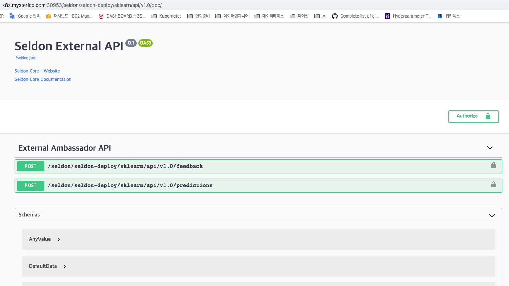

# Example Predict
여기서는 model registry에 업로드된 모델을 이용하여 predict하는 방법을 다룹니다.
REST API로 생성되는 모델 서버는 `seldon-core`를 이용하여 생성됩니다.
Pandas 및 Pyspark에서 실행되는 모델은 model registry에서 모델을 다운로드 받고, 해당 모델을 불러오는 방식으로 사용합니다.

## Pandas에서 이용하기
모델을 runs 이름을 통해 불러옵니다.
```python
import mlflow
logged_model = 'runs:/fd358f6f3f03496991c7c717f9a26488/model'

#mlflow 내장 함수를 이용해서 python 객체로 생성합니다.
loaded_model = mlflow.pyfunc.load_model(logged_model)
```
pandas를 이용해여 predict를 진행할 수 있습니다.
```python
import pandas as pd
data = [[0.1,0.2,0.3,0.4,0.5,0.6,0.7,0.8,0.9,1.0,1.1]]
result = loaded_model.predict(pd.DataFrame(data))

print(print(pd.DataFrame(data).head())
print(result))
```
output
```
    0    1    2    3    4    5    6    7    8    9    10
0  0.1  0.2  0.3  0.4  0.5  0.6  0.7  0.8  0.9  1.0  1.1

[6.3356701]
```

## Pyspark에서 이용하기
pyspark도 pandas와 동일한 과정을 거칩니다.
```python
import mlflow
logged_model = 'runs:/c3b10fa9b4c1416da7070330bdceefbf/pytorch-model'

# spark에서는 python udf로 생성하여 dataframe을 control합니다.
loaded_model = mlflow.pyfunc.spark_udf(spark, model_uri=logged_model)
```
withColumn을 이용하여 예측 결과를 붙힙니다.
```python
columns = list(df.columns)
df.withColumn('predictions', loaded_model(*columns)).collect()
```
## REST API로 이용하기
REST API는 `seldon-core`와 `ambassador gateway`를 통해 생성됩니다.   
REST API로 만들어 서버를 Kubernetes에 올리기 위해 `SeldonDeployment`를 생성합니다.   
해당 예시에서는 sklearn서버로 생성하였습니다.   
[mlflow full script 참고](mlflow-sdep.yaml)
```yaml
apiVersion: machinelearning.seldon.io/v1alpha2
kind: SeldonDeployment
metadata:
  name: sklearn
  namespace: seldon-deploy
spec:
  name: iris
  predictors:
  - graph:
      children: []
      implementation: SKLEARN_SERVER
      modelUri: gs://seldon-models/v1.12.0-dev/sklearn/iris
      name: classifier
    name: default
    replicas: 1
```
서버가 생성이 완료되면 접근할 수 있는 API서버가 아래와 같은 규칙으로 swagger가 생성됩니다.    
`http://k8s.mysterico.com:30953/seldon/{namespace}/{modelname}/api/v1.0/doc`    
위 예제에서 생성된 주소는 아래와 같습니다.   
http://k8s.mysterico.com:30953/seldon/seldon-deploy/sklearn/api/v1.0/doc/
   

생성된 API에 Request를 해보면 Predict Response를 반환합니다.    
Request
```json
// POST /seldon/seldon-deploy/sklearn/api/v1.0/predictions
{
    "data": {
        "ndarray":[[1.0, 2.0, 5.0, 6.0]]
    }
}
```
Response
```json
{
  "data": {
    "names": [
      "t:0",
      "t:1",
      "t:2"
    ],
    "ndarray": [
      [
        9.912315378486697e-7,
        0.0007015931307746079,
        0.9992974156376876
      ]
    ]
  },
  "meta": {
    "requestPath": {
      "classifier": "seldonio/sklearnserver:1.11.2"
    }
  }
}
```