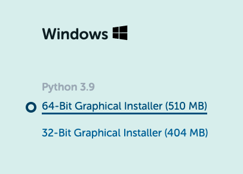
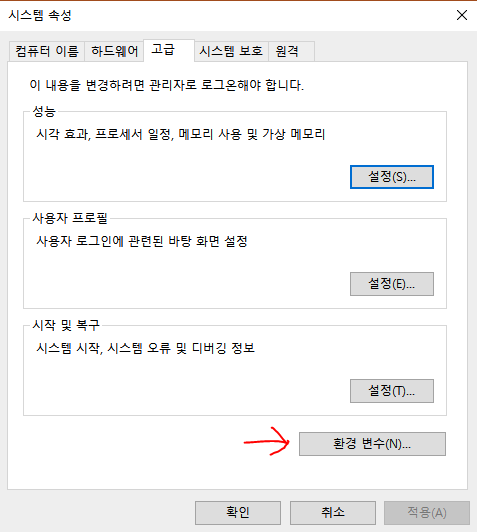
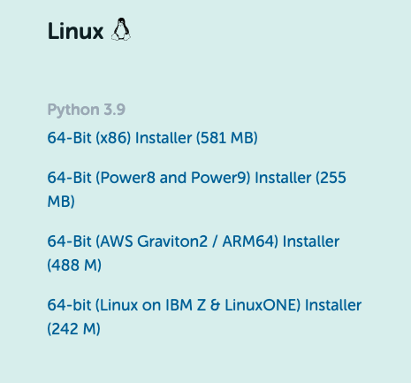
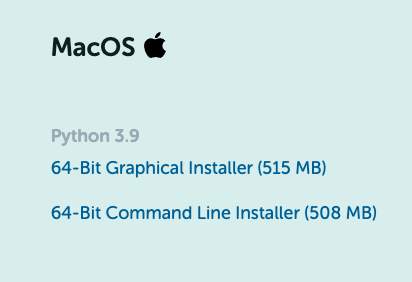

# Ready_For_MLflow
MLflow 사용을 위한 준비단계를 설명합니다.   
Anaconda를 사용하는 프로젝트와 Docker를 사용하는 프로젝트가 모두 동작할 수 있도록 준비합니다.
## 준비된 Tracking server
MLflow tracking server가 이미 구축되어 실행중임을 가정합니다.   
현재 mysterico에서 사용하는 tracking server의 주소는 아래와 같습니다.   
* Web UI 주소
    * `http://k8s.mysterico.com:31516/mlflow`
* Local에서 접근하는 API용 주소
    * `http://k8s.mysterico.com:31164`   
## 운영체제
* [Windows](#windows)
* [Linux](#linux)
* [MAC](#mac)
### Windows
#### Anaconda 설치
아나콘다 공식 홈페이지에서 아나콘다를 설치합니다.
[https://www.anaconda.com/products/individual](https://www.anaconda.com/products/individual)   
   


#### 환경 변수 설정
`제어판 > 시스템 및 보안 > 시스템 > 고급 시스템 설정 > 고급 탭 > 환경 변수`로 이동하여 환경 변수를 설정합니다.   
    


환경 변수는 사용자 변수만 수정하여도 됩니다. (굳이 시스템 변수까지는 건들지 않아도 됨)

---
* 변수 이름 : MLFLOW_TRACKING_URI
* 변수 값 : http://k8s.mysterico.com:31164
---
* 변수 이름 : MLFLOW_CONDA_HOME
* 변수 값 : C:\Users\Mysterico\Anaconda3 (아나콘다의 설치 경로 입력)
---
### Linux
(리눅스는 bash를 사용한다고 가정합니다.)
#### 의존성 라이브러리 설치
```shell
$ sudo apt-get update
$ sudo apt-get upgrade
$ sudo apt-get install libgl1-mesa-glx libegl1-mesa libxrandr2 libxrandr2 libxss1 libxcursor1 libxcomposite1 libasound2 libxi6 libxtst6
```
#### 아나콘다 설치
아나콘다 공식 홈페이지에서 아나콘다를 설치합니다.
[https://www.anaconda.com/products/individual](https://www.anaconda.com/products/individual)   
   


    
다운로드가 완료되면 shell script를 실행합니다.
```shell
cd Downloads
source Anaconda3-2021.11-Linux-x86_64.sh
```
#### 환경 변수 설정
```shell
$ vim ~/.bashrc
```
`.bashrc` 파일에 환경 변수를 설정해 줍니다.
```shell
export MLFLOW_TRACKING_URI=http://k8s.mysterico.com:31164
export MLFLOW_CONDA_HOME=$HOME/anaconda3
```
환경 변수 적용
```shell
source ~/.bashrc
```

### MAC
(MAC은 zsh를 사용한다고 가정합니다.)
#### 아나콘다 설치
아나콘다 공식 홈페이지에서 아나콘다를 설치합니다.
[https://www.anaconda.com/products/individual](https://www.anaconda.com/products/individual)   
   


#### 환경 변수 설정
```shell
$ vim ~/.zshrc
```
`.zshrc` 파일에 환경 변수를 설정해 줍니다.
```shell
export MLFLOW_TRACKING_URI=http://k8s.mysterico.com:31164
export MLFLOW_CONDA_HOME=$HOME/anaconda3
```
환경 변수 적용
```shell
source ~/.zshrc
```
### 공통
mlflow와 kubernetes 패키지를 설치합니다.
```shell
pip3 install mlflow
pip3 install kubernetes
```